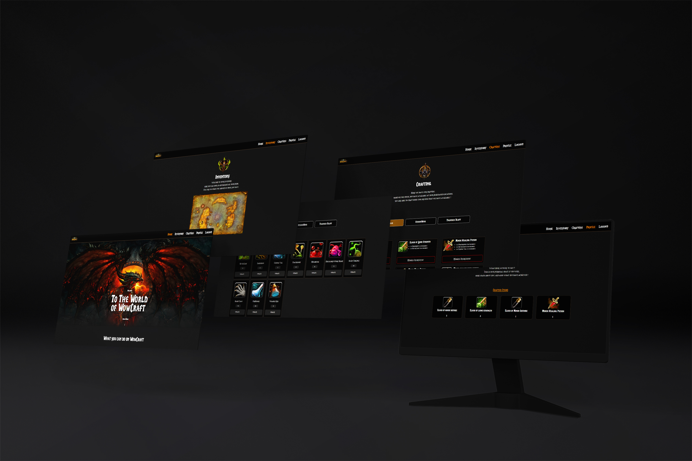

 

I'm a young web developer who just fineshed my degree at Open Window. Take alook around my profile to see some of the cool projects I have created over the course of my studies. I really have a passion for front end and mobile app development.

Oh yeah, and be sure to checkout my LinkedIn and let me know about any cool work oppertunities!

 

<h4 align="center">Explored Technologies</h4>

                      

  <!--  -->

### 

### Top Repos

        <h2>Feel Fine</h2>
        

            
              

 
 
FeelFine is a mobile Mental health application created with React Native and Google Firebase. Create journal entries that make use of IBM Wattson to perform emotion recogition. The results are displayed to the user in various ways across the front end.
        

        
     

        <h2>WoW Craft</h2>
        

            
              

 
 
WoW Craft is an Inventory management Angular web app. Users can manage their ingredient stock levels across different locations aswell as craft Items based on the availability of ingredients, making use of an express server for the backend and MongoDB as the database.
        

        
     

        <h2>Counter Skins</h2>
        

            
              

            
 
 
Counter Skins is a mobile react-native competition application where users can enter their skin designs to have the oppertunity for community members to vote for their entries. I made use of google firebase for the database and storage.
        

        
     

<!------->
<!--<h1 align="center">Here is some of the recent projects that I have worked on.</h1>-->

### Pinned Repositories 

 

<!--<a href="https://github.com/RetroPixelz/Translate">-->
<!--  -->
<!--</a>-->

 

### Get in Touch

 Shoot me an email if you see anything you like. 

- Email - Jmkoster21@gmail.com

<!-- ## Contact
- [Justin Koster](https://www.linkedin.com/in/justin-koster-502401225/) on Linkedin
- Email - Jmkoster21@gmail.com -->
  
<!--
-->
<!-- 
<h3>My Coding Journey</h3>
-->
<!--I have always loved computers and playing around with tech, but I never knew that I would end up becoming a fullstack developer. Programming kind of landed in my lap, and since then I have never looked back, from my first 'Hello, World!' to my latest project I have loved every moment of it.-->

