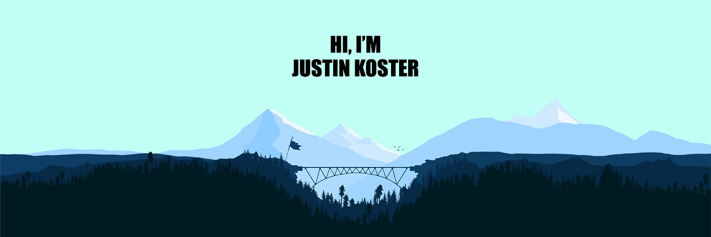

 

Young web developer & recent Open Window grad 🎓 | Passionate about front-end and mobile app development 💻📱 | Explore my projects and let's connect on LinkedIn for exciting opportunities! 🚀 

 

<h4 align="center">Explored Technologies</h4>

                      

### 

### Top Repos

        <h2>Feel Fine</h2>
        

            
              

 
 
  Dive into the realm of emotional well-being with my latest
                creation—a groundbreaking React Native mobile application
                dedicated to mental health. Harnessing the power of cutting-edge
                technology, I've integrated IBM Watson's Natural Language
                Understanding model for emotion recognition. This means your
                journal entries aren't just words; they're a visual journey into
                your emotional landscape. Experience real-time feedback, gain
                insights, and embark on a transformative self-discovery journey.
                Because mental well-being deserves a tech-savvy ally. Let's
                navigate the complexities of emotions together, one entry at a
                time.
        

        
     

        <h2>WoW Craft</h2>
        

            
              

 
 
 Dive into the immersive world of Warcraft with our cutting-edge
                Angular and Node.js application! Unleash your inner alchemist as
                you take command of ingredient stock levels and delve into the
                fascinating art of crafting within the game. Seamlessly manage
                your virtual pantry, concocting powerful recipes, and strategize
                your way to gaming glory. Whether you're a seasoned player or a
                newcomer to Azeroth, our platform empowers you to master the
                intricacies of crafting, ensuring you always have the right
                ingredients at your command. Level up your gameplay, forge
                legendary items, and become the master crafter of your own
                Warcraft adventure!
        

        
     

        <h2>Counter Skins</h2>
        

            
              

            
 
 
 Dive into the vibrant world of Counter-Strike with my latest
                creation—a dynamic React Native mobile app tailored for
                passionate gamers! Picture this: unleash your creativity, submit
                your unique skin designs, and let the community decide your
                fate. It's not just a competition; it's a thrilling showcase of
                talent. Watch as your designs come to life, go head-to-head with
                other enthusiasts, and emerge victorious as the community's
                favorite. Your chance to shine in the Counter-Strike cosmos
                awaits—show off your skins, win hearts, and claim your spot
                among the global elite!
        

        
     

 

### Get in Touch

 Shoot me an email if you see anything you like. 

- Email - Jmkoster21@gmail.com

